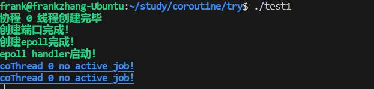

# 使用"最短运行时间先调度"逻辑的多线程携程库
- 支持设置不同线程的**优先级**，优先级越大越高
- [博客地址](https://frankzjz219.github.io/2024/01/11/%E6%90%BA%E7%A8%8B%E5%BA%93%E5%AE%9E%E7%8E%B0%EF%BC%88%E4%B8%80%EF%BC%89/)
## 文件
- 该库包含文件`cothread.h`和`cothread.cpp`
## 原理
- 调度器使用的是借助优先级队列统计当前已经运行时间最短的携程，将其最先调度
- 使用的是`<ucontext.h>`
- 编译`g++ cothread.cpp main.cpp -o test`
- 执行时间统计结果
```shell
thread 1 has been running for 1079486461
thread 0 has been running for 1079495518

thread 1 has been running for 1080034983
thread 0 has been running for 1079986142

thread 1 has been running for 1080466323
thread 0 has been running for 1080492081
```
```shell
thread 3 has been running for 11560540
thread 2 has been running for 11543938
thread 1 has been running for 11658331
thread 0 has been running for 11509848

thread 3 has been running for 11964030
thread 2 has been running for 11938902
thread 1 has been running for 11784062
thread 0 has been running for 11879633
```
- 给thread添加了优先级设置功能，每个线程计算运行时间的时候用真实的时间/优先级
- 测试结果
```shell
thread 3 has been running for 8242206
thread 2 has been running for 6113781
thread 1 has been running for 4113923
thread 0 has been running for 2097486

thread 3 has been running for 8490418
thread 2 has been running for 6297884
thread 1 has been running for 4303349
thread 0 has been running for 2243932
```
- 四个线程优先级分别是4，3，2，1，可见效果还是明显的
## 1月12日更新
- 修改为了多线程版本，添加了应对用户`Ctrl C`停止并收集线程的版本，多个线程分别调度，分别设置携程的优先级
- 结果
```shell
thread 3 has been running for 3700986
thread 2 has been running for 2826419
thread 1 has been running for 1870166
thread 0 has been running for 979257

thread 3 has been running for 4630933
thread 2 has been running for 3403631
thread 1 has been running for 2266645
thread 0 has been running for 1178867

thread 3 has been running for 4836192
thread 2 has been running for 3548546
thread 1 has been running for 2428993
thread 0 has been running for 1266614

thread 3 has been running for 5811463
thread 2 has been running for 4510098
thread 1 has been running for 2956609
thread 0 has been running for 1635317

thread 3 has been running for 6065180
thread 2 has been running for 4631231
thread 1 has been running for 3007414
thread 0 has been running for 1547652
```
## 1月13日更新
- 将尽可能多的功能封装在了头文件中，保持对用户的不可见
- 给`shceduler`增加了id属性编号
## 1月14日更新
- 改变了部分工具函数对用户的可见性，修改了控制台输出的文字格式便于阅读
- 
- 
